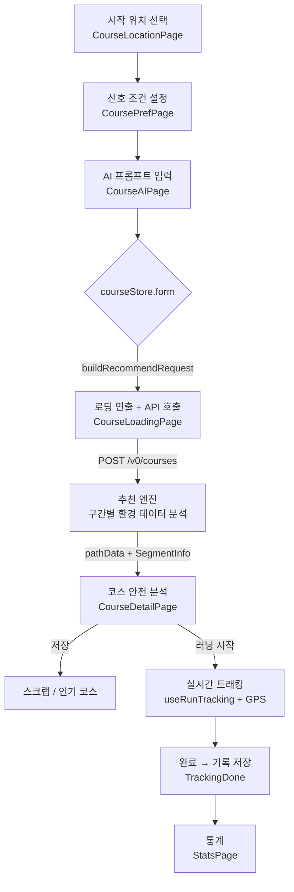

<div align="center">

# Zeph 🏃‍♂️

**AI가 만들어주는, 안전한 러닝 코스**

밤에도 안심하고 뛸 수 있게 — Zeph는 단순히 러닝을 *기록*하지 않습니다.
조명, 교통량, 신호등, 경사, 공원 같은 **구간별 환경 데이터를 AI가 분석해
가장 안전하고 쾌적한 코스를 직접 생성**합니다.

[데모](https://www.kmuzeph.site) · [디자인(Figma)](https://www.figma.com/design/gqtTV0PLz0MCDnL9NRsXVC/ZEPH) · [API 문서](https://api.kmuzeph.site/swagger-ui/index.html)

</div>

---

## 🎯 우리가 푸는 문제

기존 러닝 앱(Strava, Nike Run Club 등)은 **이미 뛴 경로를 기록**할 뿐, *어디를 뛰어야 안전한지*는 알려주지 않습니다. 그래서:

- 🌙 **야간·여성 러너**는 어두운 골목, 인적 드문 길, 교통량 많은 도로를 피하고 싶어도 판단할 근거가 없습니다.
- 📍 **낯선 동네·출장지**에서는 "어디서 뛰지?"를 고민하다 결국 안 뛰게 됩니다.
- 🗺️ 지도앱 길찾기는 *최단 경로*를 줄 뿐, 러닝에 맞는 *안전하고 쾌적한* 길을 만들어주지 않습니다.

> **Zeph의 강점은 '안전'입니다.** 밝기(`avgBrightness`), 교통량(`trafficVolumeScore`), 신호등 수(`trafficlightCount`), 경사(`slopeType`), 공원 인접 여부(`nearPark`)를 **구간 단위로 분석**해, "왜 이 코스가 안전한지"를 점수와 근거로 보여줍니다.

---

## ✨ 핵심 기능

| 기능 | 설명 |
|---|---|
| 🛡️ **AI 안전 코스 생성** | 시작 위치 + 선호(거리·유형·조명·경사·편의시설) + 자유 프롬프트를 입력하면, 백엔드 추천 엔진이 **구간별 환경 데이터 기반 최적 경로**를 생성합니다. |
| 📊 **코스 안전 분석** | 생성된 코스를 밝기·교통·경사 기준으로 분석해 지도 위에 **구간별 색상**과 근거로 시각화합니다. |
| 🏃 **실시간 트래킹** | GPS로 실제 이동 경로·거리·페이스를 기록합니다. (GPS 떨림 보정, 일시정지 처리 포함) |
| 📈 **러닝 통계** | 기간별 러닝 기록과 누적 데이터를 차트로 확인합니다. |
| 🔖 **스크랩 & 인기 코스** | 마음에 든 코스를 저장하고, 다른 러너들의 인기 코스를 둘러봅니다. |
| 🔗 **코스 공유 / GPX** | 코스를 공유하고 GPX 파일로 내보낼 수 있습니다. |

---

## 📱 스크린샷

> 이미지를 `docs/screenshots/` 폴더에 넣고 아래 경로에 맞춰 파일명을 지정하면 자동으로 렌더링됩니다.

| 온보딩 | 코스 생성 (선호 설정) | AI 프롬프트 |
|:---:|:---:|:---:|
|  |  |  |

| 코스 안전 분석 | 실시간 트래킹 | 러닝 통계 |
|:---:|:---:|:---:|
|  |  |  |

<!--
스크린샷 촬영 팁
- iPhone 세로(예: 390×844) 비율로 통일하면 깔끔합니다.
- 발표/심사에서 가장 강조할 화면은 "코스 안전 분석"(04) — 안전 강점이 한눈에 보이는 컷으로.
-->

---

## 🛠 Tech Stack

| Category | Stack |
|---|---|
| Framework | **React 19** + TypeScript |
| Build | Vite 7 |
| Styling | Tailwind CSS v4 (디자인 토큰 SSOT) |
| Routing | React Router v7 |
| 서버 상태 | TanStack Query (React Query) v5 |
| 클라이언트 상태 | Zustand v5 |
| HTTP | Axios (인터셉터 기반 인증) |
| 애니메이션 | Framer Motion |
| 지도 | Kakao Maps SDK / Kakao Local API |
| 폰트 | Pretendard |
| PWA | vite-plugin-pwa |
| Lint / Format | ESLint + Prettier + Husky |

---

## 🏗 아키텍처

### 레이어 구조

Zeph 프런트엔드는 **관심사 분리**를 기준으로 레이어를 나눕니다. 화면(pages)은 상태(stores)와 서버 통신(apis)을 조합만 하고, 실제 로직은 hooks/utils로 내려 재사용성을 높였습니다.

```
src/
├── pages/         # 라우트 단위 화면 (onboarding · course · tracking · stats · scrap · popular)
├── components/    # 재사용 UI (common · layout · Header · Icon 등)
├── hooks/         # 도메인 훅 (useRunTracking · useKakaoMaps · useSaveToScrap)
├── stores/        # 클라이언트 전역 상태 (courseStore · trackingStore) — Zustand
├── apis/          # 백엔드 API 함수 (courses · auth · records · scraps · likes · groups)
├── lib/           # 인프라 (axios 인스턴스 · auth 토큰 관리)
├── routes/        # 라우트 가드 (RequireAuth)
├── styles/        # 디자인 토큰 SSOT (index.css @theme + tokens/)
├── utils/         # 순수 헬퍼 (geo 거리계산 · format · devSim)
└── types/         # 공통 타입
```

### 상태 관리 전략

- **서버 상태**는 **React Query**로 관리 — 캐싱·로딩·에러를 선언적으로 처리.
- **플로우/세션 상태**는 **Zustand**로 관리:
  - `courseStore` — 코스 생성 3-스텝(위치→선호→프롬프트) 간 공유 폼 + 추천 결과.
  - `trackingStore` — 러닝 세션 상태.
- **인증**은 `lib/axios.ts` 인터셉터가 담당 — 요청에 Bearer 토큰 주입, 401 시 토큰 정리.

### 코스 생성 → 트래킹 데이터 흐름



### 안전 데이터 모델 (핵심)

추천 엔진은 경로를 **구간(segment) 단위**로 쪼개 아래 값을 함께 내려줍니다. 이 데이터가 Zeph "안전" 강점의 근거입니다.

```ts
type SegmentInfo = {
  lengthM?: number;            // 구간 길이
  avgBrightness?: number;      // 평균 밝기 (야간 안전)
  slopeType?: string;          // 경사 유형
  nearPark?: boolean;          // 공원 인접 (쾌적도)
  trafficlightCount?: number;  // 신호등 수 (끊김/안전)
  trafficVolumeScore?: number; // 교통량 점수 (안전)
};
```

---

## 🚀 Getting Started

### 1. 설치

```bash
npm install
```

### 2. 환경 변수

프로젝트 루트에 `.env` 파일을 만들고 아래 값을 채웁니다. (지도가 이 키에 의존하므로 필수)

```bash
VITE_API_URL=https://api.kmuzeph.site      # 백엔드 API (미설정 시 기본값 사용)
VITE_KAKAO_JS_APP_KEY=your_kakao_js_key    # Kakao Maps SDK
VITE_KAKAO_REST_API_KEY=your_kakao_rest_key # Kakao Local 검색
```

### 3. 실행

```bash
npm run dev       # 개발 서버
npm run build     # 프로덕션 빌드
npm run preview   # 빌드 프리뷰
npm run lint      # 린트
npm run format    # 포맷
```

---

## 🌿 Branch Strategy

작업은 항상 `develop`에서 분기 → `develop`으로 PR 후 머지합니다.

---

## 🎨 Design Tokens

모든 컬러/타이포그래피는 Figma 디자인 시스템과 **1:1 매핑**되며, `src/styles/index.css`의 `@theme`가 단일 진실 공급원(SSOT)입니다.

```tsx
// 99%는 Tailwind 클래스로
<button className="bg-primary text-text-on-primary text-body-md">
  러닝 시작
</button>

// JS에서 색을 직접 써야 할 때만
import { colors } from '@/styles/tokens/colors';
<motion.div animate={{ backgroundColor: colors.primary.DEFAULT }} />
```

| Token | Class 예시 | 용도 |
|---|---|---|
| `--color-primary` | `bg-primary` | 메인 그린 |
| `--color-text-primary` | `text-text-primary` | 본문 메인 |
| `--color-text-secondary` | `text-text-secondary` | 본문 보조 |
| `--text-h1` | `text-h1` | 페이지 헤딩 |
| `--text-body-md` | `text-body-md` | 기본 본문 |

> 🚨 **Hex 직접 사용 금지** — 토큰이 없을 경우에만 예외적으로 사용해주세요.

---

## 📝 Code Convention

- **들여쓰기**: 2 spaces
- **세미콜론**: 사용
- **따옴표**: single quote (`'`)
- **컴포넌트**: 함수형, PascalCase
- **파일명**: 컴포넌트는 PascalCase, 그 외 camelCase
- **저장 시 자동 포맷** 활성화 권장 (VS Code: Format on Save)
- 커밋 전 Husky가 lint/format을 검사합니다.

---

## 🔗 Links

- **Figma**: [디자인 파일](https://www.figma.com/design/gqtTV0PLz0MCDnL9NRsXVC/ZEPH)
- **API 문서**: [Swagger](https://api.kmuzeph.site/swagger-ui/index.html)
- **Backend Repo**: _TBD_
- **Notion**: _TBD_
